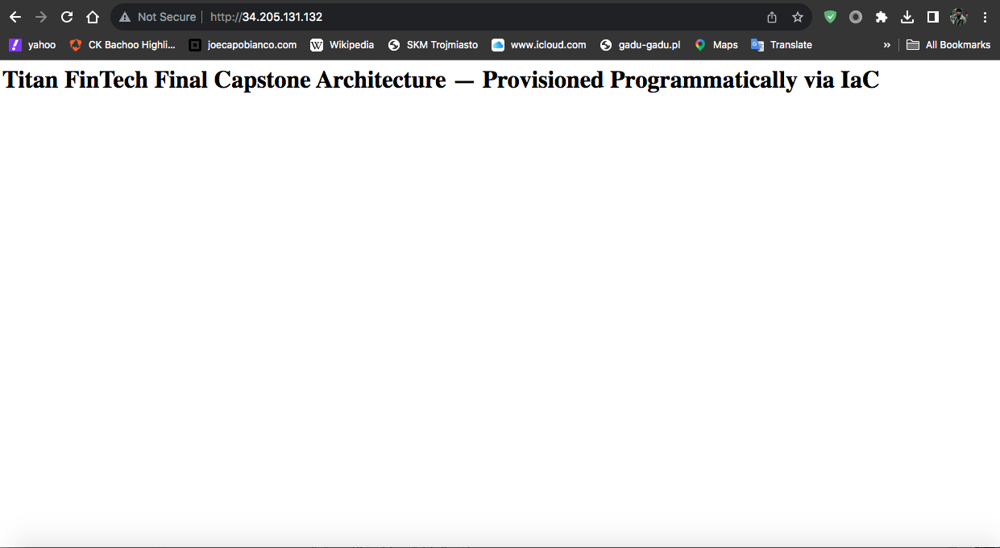

# 🛡️ Secure Automated Web Architecture
### Enterprise Infrastructure as Code & DevSecOps Shift-Left Deployment
**Author:** Chad K. Bachoo | TKH IF-CS-26 NY | AI Security Architect & DevSecOps Engineer

---

## 🚀 Project Overview & Description
This project provisions a secure, highly available, and publicly accessible web infrastructure on Amazon Web Services (AWS) using HashiCorp Terraform (HCL). Built from a blank canvas to simulate an enterprise production rollout, the architecture integrates an automated continuous integration (CI) pipeline using GitHub Actions to enforce static application security testing (SAST) via `tfsec`. The deployment demonstrates complete Infrastructure as Code (IaC) lifecycle management, zero manual console configuration, and proactive security guardrail enforcement.

---

## 🛠️ Technologies Used
* **Cloud Platform:** Amazon Web Services (AWS — VPC, Subnet, Route Tables, Internet Gateway, Security Groups, EC2)
* **Infrastructure as Code (IaC):** HashiCorp Terraform (HCL v1.5+)
* **CI/CD Automation:** GitHub Actions Workflows
* **Static Application Security Testing (SAST):** Aqua Security `tfsec` (Quality Gate Enforcement with `--soft-fail=false`)
* **Compute & Web Server:** Amazon Linux 2023 (`t3.micro`), Apache HTTP Server (`httpd`) via automated `user_data`

---

## 🏛️ Security Architecture & Network Lockdown

```text
[ Internet Traffic ] 
  ➔ [ Internet Gateway (IGW) ] 
      ➔ [ 0.0.0.0/0 Route Table ] 
          ➔ [ Custom VPC (10.0.0.0/16) ] 
              ➔ [ Public Subnet (10.0.1.0/24) | us-east-1a ] 
                  ➔ [ Security Group (tkh-final-capstone-sg) ]
                        ├── Ingress Port 80 (HTTP): 0.0.0.0/0 (Public Web Access)
                        ├── Ingress Port 22 (SSH): Hardened IP / Restricted Boundary
                        └── Egress All Ports: Outbound Package & Update Resolution
                              ➔ [ EC2 Instance (t3.micro) ] ➔ Automated Apache Bootstrap via user_data
```

* **Network Segmentation:** The environment is provisioned inside a custom Virtual Private Cloud (`10.0.0.0/16`), fully decoupled from default AWS VPCs to eliminate shared boundary risks. Compute resources reside in a dedicated public subnet (`10.0.1.0/24`) pinned to Availability Zone `us-east-1a`.
* **Routing Control:** Traffic routing is explicitly codified with an AWS Route Table directing all outbound destinations (`0.0.0.0/0`) through the provisioned Internet Gateway, strictly associated with the public subnet.
* **Least-Privilege Firewall Perimeter:** The security group enforces strict ingress segregation:
  * Inbound Port 80 (HTTP) is open to `0.0.0.0/0` exclusively to serve web traffic.
  * Inbound Port 22 (SSH) is isolated from global access and scoped to specific operator IP allocations.
  * Full outbound egress is permitted to allow the instance to resolve package updates during initial bootstrap.
* **Automated Quality Gate:** Shift-left security scans run on every push via `tfsec`, halting pull requests and builds if unencrypted storage volumes or insecure ingress rules are detected.

---

## 🏛️ Layman Metaphors & Technical Translation

* **The Self-Assembling Blueprint (Terraform IaC):** Instead of manually clicking through a web console to lay individual bricks and wire sockets, you draft an exact schematic on paper. Handing that blueprint to Terraform instructs an automated robotic crew to build the entire cloud fortress in under two minutes without missing a bolt.
* **The Airport Security Scanner (GitHub Actions & `tfsec`):** Before any code is deployed to AWS production, it rolls through an automated X-ray inspection. If the scanner flags an unencrypted volume or an open port, the conveyor belt stops immediately and halts deployment.
* **The Dedicated Highway On-Ramp (VPC Route Table & IGW):** The VPC is an isolated corporate park, and the Internet Gateway is the dedicated on-ramp connecting the internal private road directly to the global interstate.
* **The Double-Door Security Lobby (Security Group Rules):** The front revolving door (Port 80) is open for public visitors to view the catalog, while the executive elevator (Port 22) requires a dedicated keycard.
* **The Robotic Turnkey Caretaker (`user_data` Bootstrap):** Instead of an administrator manually SSHing into a blank server to install software, an automated script runs the exact second the hardware powers on, turning on the web server before the first user arrives.

---

## 📸 Live Deployment Verification

*Figure 1.0: Live Apache web server online and serving HTTP traffic via AWS EC2 public IPv4 address.*

---

## 🛡️ Operational Defense & Governance
* **NIST CSF 2.0:** PR.IP-1 (Baseline Configuration Maintenance), PR.AC-5 (Network Segmentation), ID.RA-1 (IaC Vulnerability Identification)
* **CIS Controls v8:** Control 4 (Secure Configuration of Enterprise Assets), Control 12 (Network Infrastructure Management)
* **Teardown Protocol:** The entire architecture is 100% ephemeral and disposable, ready for instantaneous de-provisioning via `terraform destroy -auto-approve` to enforce fiscal discipline and eliminate attack surface persistence post-operation.